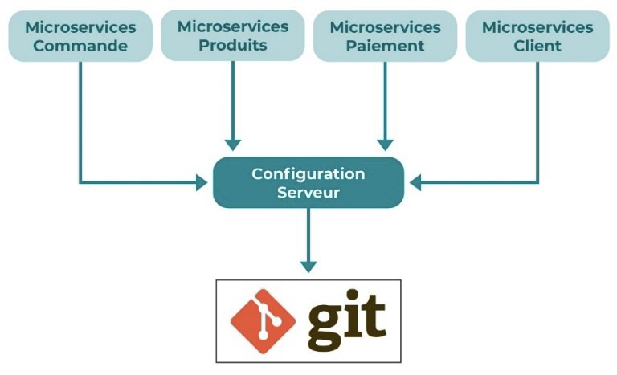
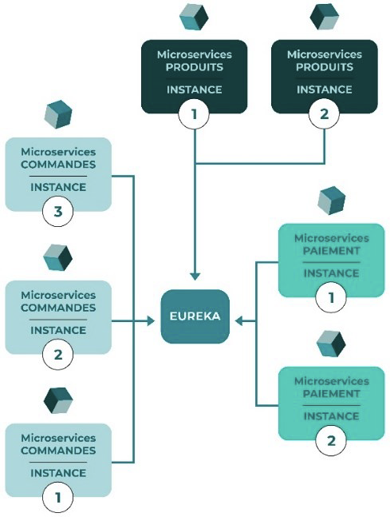
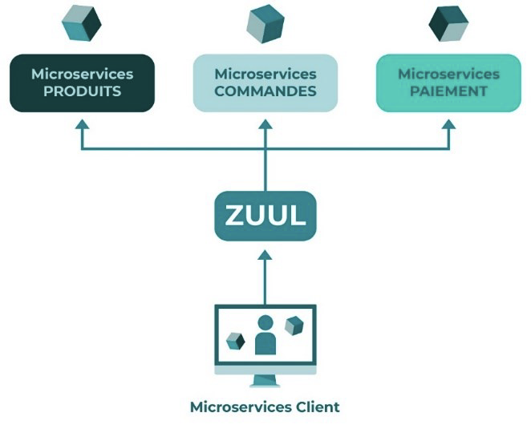
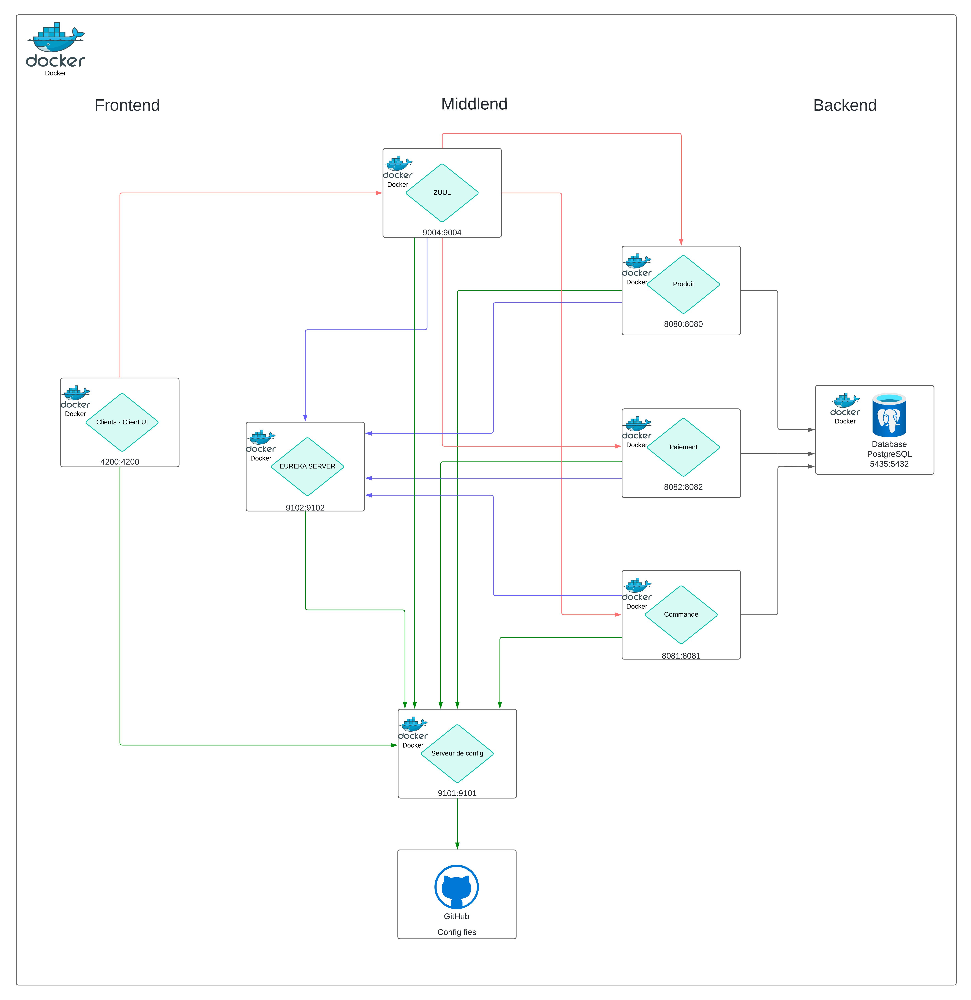
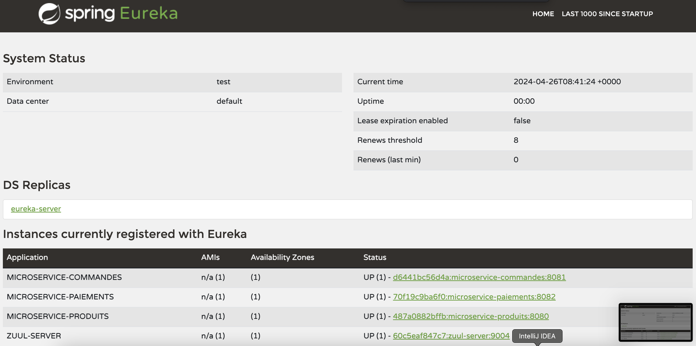

# TP Edge Services - Ecommerce  - FISA 4 INFO - INSA Hdf
[](https://github.com/mayel15/projet-intergiciel) [](https://github.com/mayel15/projet-intergiciel)

|   |           |  |
| :--------------: | :--------------: | :--------------: |
| Alaaeddin ALMAJJO | Ayman DOULKOM        | Pape THIAM  |
| 22001993  | 22008795           | 22009010  |
| [@aladinMJ](https://github.com/aladinMJ) | [@ayman-h226](https://github.com/ayman-h226)        | [@mayel15](https://github.com/mayel15)  |
| alaaeddin.almajjo@uphf.fr  | aymanbenewende.doulkom@uphf.fr           | papemayeldiagne.thiam@uphf.fr  |

# Technos utilisés

   <a href="https://angular.io" target="_blank" rel="noreferrer">  </a> <a href="https://www.java.com" target="_blank" rel="noreferrer">  </a> <a href="https://docs.spring.io/spring-boot/docs/current/reference/htmlsingle/" target="_blank" rel="noreferrer">  </a> <a href="https://postman.com" target="_blank" rel="noreferrer">  </a> <a href="https://www.postgresql.org" target="_blank" rel="noreferrer">  </a> </a> <a href="https://www.docker.com/" target="_blank" rel="noreferrer">  </a>

# Description du projet 

Ce projet vise à mettre en place les fondations nécessaires pour développer des micro-services orientés Edge dans le cadre d'une application de e-commerce simple. 

- **Objectifs Principaux :**
    - **Gestion des Clients :** Développer un micro-service permettant de gérer des clients. C'est plus géré sur la partie front client UI et pour se connecter (login: admin, password: admin) pour tous les users
    <br>Modele Relationel BDD: Client(#id, login, password) 
    <br>Voici les endpoints qu'on pourrait implémenter

    | Method | Endpoints     | Description                       |
    | :-------- | :------- | :-------------------------------- |
    | `GET`      | `/api/clients` | Avoir tous les clients |
    | `POST`      | `/api/clients/login` | Se comnecter avec un login et password |
    | `POST`      | `/api/clients/sign-up` | S'inscrire avec login et password |

    - **Gestion des Produits :** Créer un micro-service pour gérer la liste des produits disponibles à la vente, incluant l'ajout et la suppression de produits.
    <br>Modele Relationel BDD: Produit(#id, titre, description, image, prix) 
    <br>Voici les API développés

    | Method | Endpoints     | Description                       |
    | :-------- | :------- | :-------------------------------- |
    | `GET`      | `/api/produits` | Avoir la liste des produits |
    | `GET`      | `/api/produits/:id` | Avoir un produit par son id |
    | `POST`      | `/api/produits/ajouter` | Ajouter un produit |
    | `DELETE`      | `/api/produits/:id` | Supprimer un produit par son id |

    - **Gestion des Commandes :** Mettre en place un micro-service pour traiter les commandes passées par les clients, y compris le suivi et la gestion de l'état des commandes.
    <br>Modele Relationel BDD: Commande(#id, productId, quantite, dataCommande, commandePayee)
    <br>Voici les API développés 

    | Method | Endpoints     | Description                       |
    | :-------- | :------- | :-------------------------------- |
    | `GET`      | `/api/commandes` | Avoir toutes les commandes |
    | `GET`      | `/api/commandes/:id` | Avoir une commande par son id |
    | `POST`      | `/api/commandes/ajouter` | Passer une commande |

    - **Système de Paiement :** Développer un micro-service de simulation de paiement pour traiter les transactions de paiement des commandes. 
    <br>Modele Relationel BDD: Paiement(#id, idCommande, montant, numeroCarte) 
    <br>Voici les API développés

    | Method | Endpoints     | Description                       |
    | :-------- | :------- | :-------------------------------- |
    | `GET`      | `/api/paiements` | Avoir tous les paiements |
    | `POST`      | `/api/paiements/ajouter` | Passer un paiement d'une commande |

- **Architecture Plausible :**
    - **Langage et Framework :** Utilisation de Java avec le framework Spring Boot (version récente) pour la mise en œuvre des micro-services. Spring Boot offre une configuration simplifiée et une intégration transparente avec les services web.
    - **Bases de Données :** Mise en place d'une base de données PostgreSQL partagée entre les micro-services

- **Développement de l'UI Client :**
    - Création d'une interface utilisateur (UI) simple Angular pour exploiter les fonctionnalités des micro-services décrits ci-dessus. L'UI permettra aux utilisateurs de visualiser les produits, de passer des commandes et de suivre l'état de leurs paiements.


# Décentralisation de la configuration des microservices




La déportation de la configuration des micro-services présente plusieurs avantages significatifs dans le contexte d'une architecture de microservices :

**1. Séparation des préoccupations :** En déportant la configuration des micro-services, on sépare les préoccupations liées à la configuration de celles liées à la logique métier. Cela permet de maintenir un code plus clair et modulaire, facilitant ainsi la maintenance et l'évolutivité du système.

**2. Centralisation de la configuration :** En centralisant la configuration des micro-services, on simplifie la gestion et la mise à jour des configurations. Plutôt que de devoir modifier la configuration de chaque micro-service individuellement, on peut le faire à un seul endroit centralisé, ce qui réduit les risques d'erreurs et accélère le déploiement des changements de configuration.

**3. Flexibilité et dynamisme :** La déportation de la configuration permet d'ajuster dynamiquement les paramètres des micro-services sans avoir à redéployer l'application entière. Cela facilite la gestion des configurations en fonction des environnements (développement, test, production) et permet une plus grande agilité dans la gestion des configurations.

# Eureka - Naming Service



Dans le cadre de ce projet, l'intégration d'Eureka, en tant que serveur de registre des services, présente plusieurs avantages significatifs :

**1. Découverte dynamique des services :** Eureka permet une découverte dynamique des services enregistrés dans le registre. Cela signifie que les différents micro-services peuvent s'inscrire auprès d'Eureka lors de leur démarrage, ce qui permet à d'autres services de les découvrir automatiquement sans nécessiter une configuration manuelle des adresses IP ou des URL.

**2. Équilibrage de charge et résilience :** Eureka facilite l'équilibrage de charge et la résilience en permettant l'enregistrement de plusieurs instances d'un même service. Les clients peuvent alors accéder à ces instances de manière transparente, ce qui améliore la disponibilité et la performance du système.

**3. Surveillance et supervision :** Eureka fournit des fonctionnalités de surveillance et de supervision des services enregistrés. Cela permet de détecter rapidement les pannes ou les indisponibilités des services et de prendre des mesures correctives, telles que la bascule vers des instances de secours ou le redémarrage des services défaillants.

**4. Intégration transparente avec d'autres composants :** Eureka s'intègre facilement avec d'autres composants de l'écosystème Spring Cloud, tels que Zuul pour la passerelle d'API et Ribbon pour le client REST. Cela permet de construire des architectures de microservices robustes et évolutives en combinant plusieurs outils et frameworks bien intégrés.

**5. Écosystème open source et support communautaire :** Eureka fait partie de l'écosystème Spring Cloud, qui bénéficie d'un large support communautaire et d'une documentation abondante. Cela facilite l'adoption et la mise en œuvre d'Eureka dans le cadre du projet, tout en permettant d'accéder à des ressources et à des exemples pertinents pour résoudre les problèmes éventuels.

# Zuul Proxy - API Gateway



L'API Gateway Zuul offre plusieurs avantages stratégiques et techniques pour ce projet spécifique :

**1. Point d'entrée unique :** Zuul agit en tant que point d'entrée unique pour les requêtes provenant des clients externes. Cela simplifie l'architecture en centralisant la gestion du trafic entrant et sortant, facilitant ainsi la surveillance, la gestion des erreurs et la mise en œuvre de politiques de sécurité cohérentes.

**2. Routage dynamique des requêtes :** Zuul permet de router dynamiquement les requêtes vers les micro-services appropriés en fonction des règles de routage configurées. Cela simplifie la gestion des routes et permet d'ajuster facilement les chemins d'accès aux services sans nécessiter de modification des clients ou des services eux-mêmes.

**3. Gestion des requêtes et des réponses :** Zuul offre des fonctionnalités avancées de gestion des requêtes et des réponses, telles que la transformation, la validation, la pagination, etc. Cela permet de centraliser la logique de traitement des requêtes au niveau de la passerelle, réduisant ainsi la complexité des micro-services individuels.

**4. Sécurité et authentification :** Zuul peut être utilisé pour mettre en œuvre des stratégies de sécurité telles que l'authentification, l'autorisation, le filtrage IP, etc. Cela renforce la sécurité du système en empêchant les accès non autorisés et en protégeant les services contre les attaques malveillantes.

**5. Intégration avec d'autres services :** Zuul s'intègre facilement avec d'autres composants de l'écosystème Spring Cloud, tels que Eureka pour la découverte des services et Ribbon pour le client REST. Cela permet de construire des architectures robustes et évolutives en combinant plusieurs outils bien intégrés.

# Architecture globale




# Clean, Compile, Package

- Dans le projet, un fichier `.jar` a été déjà généré pour chaque microservice pour les builds d'images docker

- En cas de changements des fichiers sources, il faut **recompiler** et **packager** le projet concerné avec `maven` afin de pouvoir obtenir le `.jar` pour builder une nouvelle image docker

- Exemple avec le microservice `microservice-produits`


- Fortement conseillé de le faire pour chaque microservice

# Configuration et lancement des microservices

- Cloner le projet 
```sh
git clone https://github.com/ayman-h226/Tp-E-Commerce.git
```

- Lancer les microservices avec `docker` à la racine du projet
```sh
cd Tp-E-Commerce
```

```sh
docker-compose up -d
```

- Patienter jusqu'à lancement complet de tous les services du `docker-compose`

- Il peut arriver que le demarrage de `eureka-server` et de `zuul-server` se passe mal; donc ne pas hésiter à le relancer depuis le Docker Desktop

- Aperçu de Eureka server en `localhost` au port `9102`



# Test des API avec Postman

- Ouvrir Postman et importer la collection `./Tp-E-Commerce.postman_collection.json` pour tester quelques API
